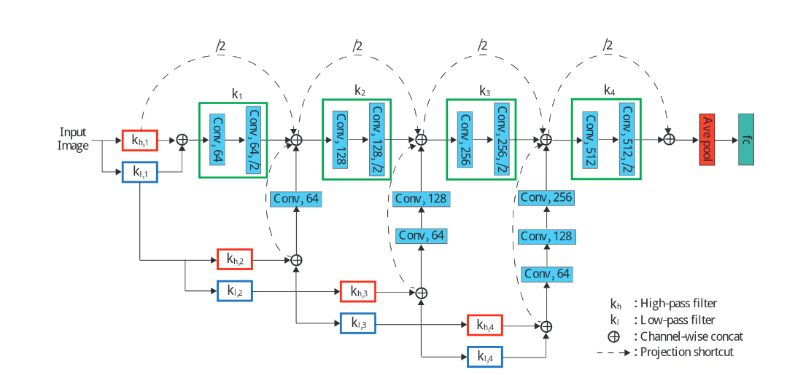

# WaveletCNN

Implementation of  using keras deep learning framework. I work with this paper for my undergraduate research. 

# Dataset 

Dataset used in this paper is not open so I use cat vs dog dataset to test WaveletCNN implementaiton 

# Requirements

- Python 3+ 
- Tensorflow >= 1.12
- Keras 2.2.4
- Matplotlib

# Reference

- 
